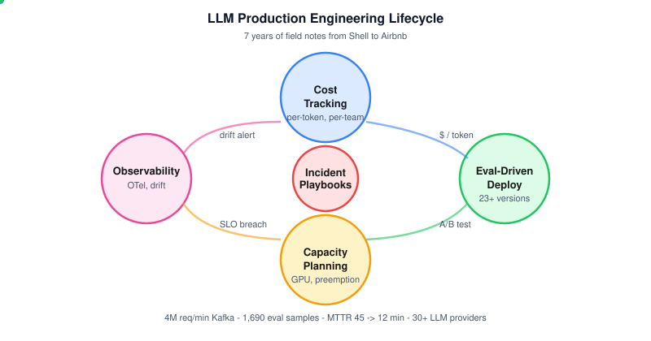
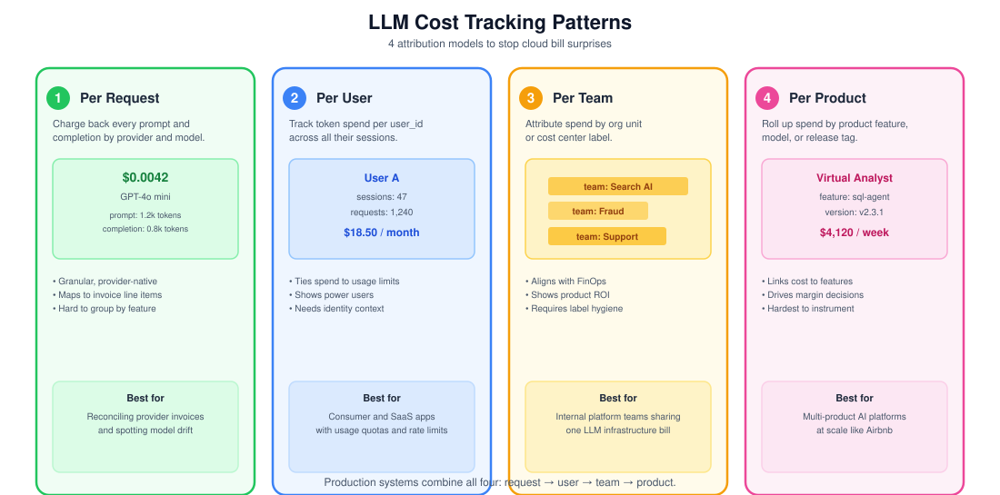
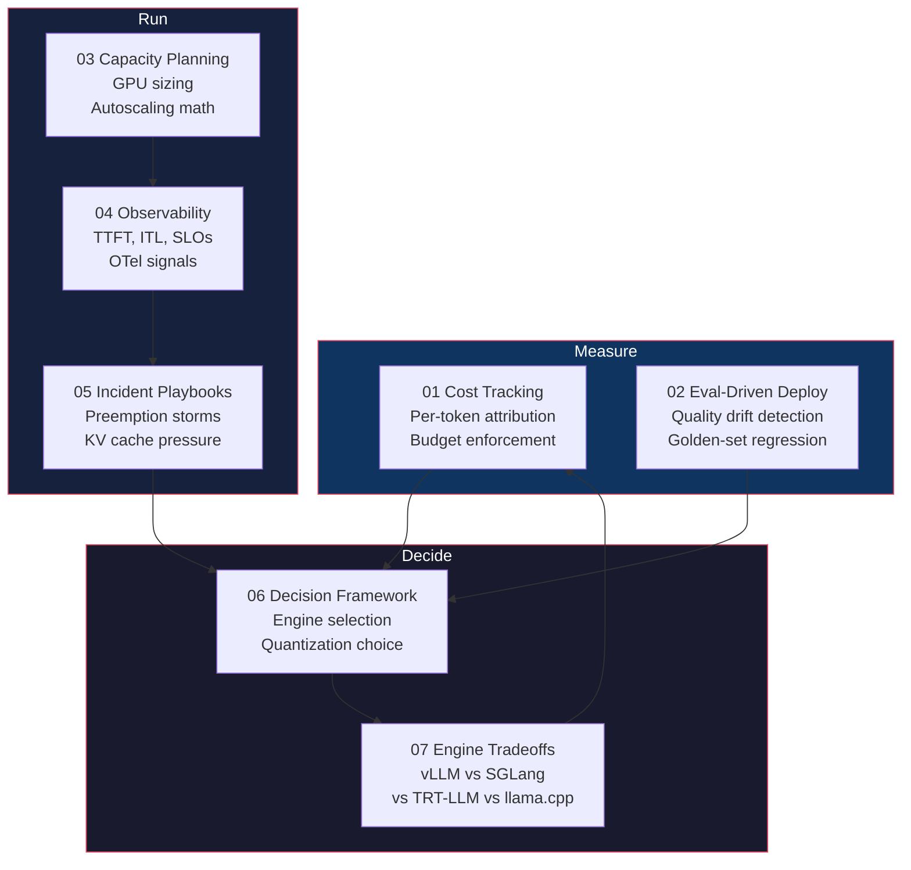
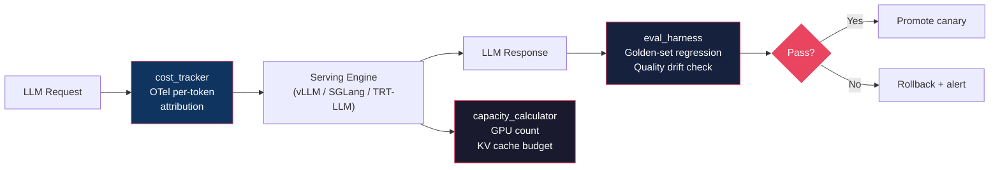

  

# LLM Production Engineering

> Field notes from building AI systems in production since 2019 - from
> Shell's Responsible AI team to Airbnb's ML infrastructure. Focused on the
> LLM serving era (2023 onward).

Most LLM inference content explains how the systems work: PagedAttention
internals, quantization algorithms, attention variants. This repo covers the
other half - **how to run them in production**: track cost per token, catch
quality drift before users do, plan capacity, survive preemption storms, and
pick the right engine for your workload.

This is the repo I wish I had when I transitioned from traditional ML
infrastructure into LLM serving in 2023. The lessons come from 7 years of
production AI engineering, not from reading papers.

  

## Who this is for

ML infrastructure engineers, MLOps teams, and platform engineers who are
responsible for running LLM serving in production. If you own cost, latency
SLOs, or on-call for LLM endpoints, this is for you.

If you are learning how vLLM works internally, read the papers and the
official docs first. Come back here when you have to run it for real.

## What is in here

### Architecture

The seven sections map to the lifecycle of running LLM serving in production.
Cost and eval feed into deployment decisions; capacity and observability keep
the system alive; incident playbooks handle the failures; decision frameworks
and engine tradeoffs guide architecture choices:

  

### Cost attribution patterns

Production teams need cost tracking at multiple levels of granularity. Each pattern has different tradeoffs:

  

Reference implementations under `code/`:

### Docs

| Section | Topic | Angle |
|---------|-------|-------|
| [01-cost-tracking](docs/01-cost-tracking/) | Per-token cost attribution, budget enforcement, chargeback | Cost |
| [02-eval-driven-deployment](docs/02-eval-driven-deployment/) | Quality drift detection, golden-set regression, canary deploys | Eval |
| [03-capacity-planning](docs/03-capacity-planning/) | Sizing LLM serving, autoscaling, GPU allocation math | Ops |
| [04-observability](docs/04-observability/) | TTFT, ITL, SLOs, OTel signals for LLM serving | Ops |
| [05-incident-playbooks](docs/05-incident-playbooks/) | Preemption storms, GPU failure, KV cache pressure, cold start spikes | Ops |
| [06-decision-framework](docs/06-decision-framework/) | Engine, quantization, and config selection decision trees | Decisions |
| [07-engine-tradeoffs](docs/07-engine-tradeoffs/) | vLLM vs SGLang vs TensorRT-LLM vs llama.cpp production matrix | Decisions |

### Code

| Module | Purpose | Status |
|--------|---------|--------|
| [code/cost_tracker/](code/cost_tracker/) | OpenTelemetry-based per-token cost tracking reference impl | **Complete (100% tests)** |
| [code/capacity_calculator/](code/capacity_calculator/) | LLM serving sizing script (GPU count, KV cache budget) | **Complete (100% tests)** |
| [code/eval_harness/](code/eval_harness/) | Golden-set regression harness for LLM quality drift | In progress |

### Case studies

Sanitized production incident postmortems and capacity planning decisions.
Pending legal approval. See [case-studies/](case-studies/).

## Why this repo exists

I started in AI infrastructure in 2019 on Shell's Responsible AI team,
building ML systems for energy applications before "LLM" was a household
term. When ChatGPT launched in late 2022, the infrastructure world pivoted
hard to LLM serving, and I pivoted with it - first into LLM evaluation
infrastructure, then into production LLM serving at Airbnb.

The gap I kept hitting: there was plenty of content explaining how
PagedAttention works or how AWQ quantizes weights, but almost nothing
explaining:

- How do I track cost per token across 30+ models with different pricing?
- How do I catch quality drift before users complain?
- How do I size GPU capacity for a workload with 100x traffic variance?
- What do I do when vLLM preemption storms hit at 3am?
- How do I decide between vLLM, SGLang, and TensorRT-LLM for my workload?

This repo is my answer to those questions, grounded in production experience.
Every recommendation comes from running these systems under real traffic,
not from reading docs.

## Sources and attribution

All topics covered here are public knowledge grounded in primary sources:
SOSP papers, official engine documentation, vendor engineering blogs, and
production experience. No content is adapted from any proprietary handbook.
See [docs/SOURCES.md](docs/SOURCES.md) for the full source list per section.

## License

MIT. See [LICENSE](LICENSE).

## Author

Sai Likhith Kanuparthi - ML infrastructure engineer. 7 years in production
AI, currently building LLM serving infrastructure at Airbnb.

- GitHub: [sailikhithk](https://github.com/sailikhithk)
- LinkedIn: [sailikhithk](https://linkedin.com/in/sailikhithk)
- Portfolio: [sailikhith.me](https://sailikhith.me)

## Building in public

I am documenting the development of this repo in a weekly LinkedIn series
under `#BuildingInPublic #MLEngineering #LLMOps`. Each section ships with a
companion post that covers the key lesson.

---

## About the author

**Sai Likhith Kanuparthi** is a Senior AI Infrastructure & Systems Engineer
at Airbnb, building production GenAI platforms with 30+ foundation model
integrations. 7+ years shipping production AI systems at Airbnb, Southwest
Airlines, Shell, Eli Lilly, and Oracle. MS Computer Science from NYU.

- **GitHub:** [github.com/sailikhithk](https://github.com/sailikhithk)
- **LinkedIn:** [linkedin.com/in/sailikhithk](https://www.linkedin.com/in/sailikhithk)
- **Portfolio:** [sailikhith.me](https://sailikhith.me)
- **Other open-source projects:**
  - [Synthetic-AI-Image-Detector](https://github.com/sailikhithk/Synthetic-AI-Image-Detector) - Multi-signal deepfake detection with calibration
  - [mamba-from-scratch](https://github.com/sailikhithk/mamba-from-scratch) - S4, Mamba-1, Mamba-2 in pure PyTorch

---

## Keywords

`Sai Likhith Kanuparthi` `LLM Production Engineering` `LLM serving` `vLLM`
`AWS Bedrock` `OpenAI` `Anthropic Claude` `cost tracking` `token attribution`
`OpenTelemetry` `MLOps` `LLM observability` `capacity planning`
`eval-driven deployment` `incident playbooks` `production AI` `Python`

