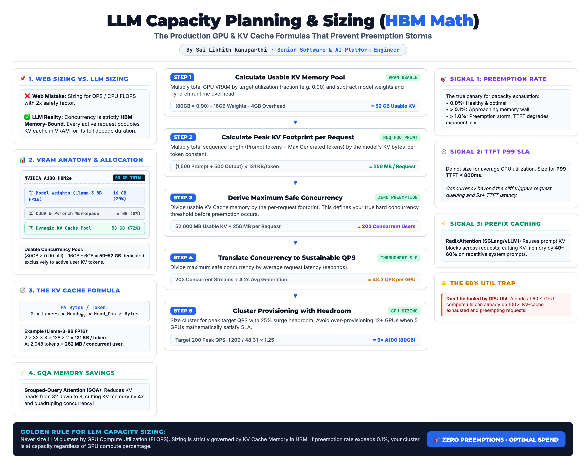

# Section 03 - Capacity Planning & Sizing

> **The production GPU and KV cache math that prevents preemption storms and cuts over-provisioned infrastructure spend.**



---

## 1. The Core Bottleneck: Compute vs. Memory Bound

In standard web services, scaling is governed by CPU compute (FLOPS) and requests-per-second (QPS). 

In **LLM serving**, inference has two distinct execution phases with radically different bottlenecks:

1. **Prefill Phase (Prompt Ingestion):** Compute-bound. The model ingests all prompt tokens in parallel and populates the Key-Value (KV) cache.
2. **Decode Phase (Token-by-Token Generation):** **Memory-Bandwidth & VRAM Capacity Bound**. For every generated token, the GPU must stream all active model weights and previous KV cache tensors across the memory bus.

```
┌─────────────────────────────────────────────────────────────────────────────┐
│                           NVIDIA A100 (80GB HBM2e)                          │
├──────────────────────┬──────────────────────┬───────────────────────────────┤
│  Model Weights (20%) │   Workspace (8%)     │     KV Cache Pool (72%)       │
│  Llama-3-8B: 16 GB   │   CUDA / Activations │     ~52–58 GB for Active      │
│  (Static Read-Only)  │   ~4–6 GB (Transient)│     User Concurrency Streams  │
└──────────────────────┴──────────────────────┴───────────────────────────────┘
```

> ⚠️ **The Critical Insight:** Your true concurrency ceiling is NOT determined by QPS. It is governed by how many KV cache blocks fit in available High-Bandwidth Memory (HBM) without triggering evictions.

---

## 2. The KV Cache Mathematical Formula

Every active request occupies dedicated KV cache memory in VRAM across its entire generation cycle:

$$\text{KV Bytes per Token} = 2 \times L \times H_{\text{KV}} \times D_{\text{head}} \times P$$

Where:
* $L$ = Number of Transformer Layers
* $H_{\text{KV}}$ = Number of Key-Value Heads (accounts for Grouped-Query Attention)
* $D_{\text{head}}$ = Attention Head Dimension ($\text{Hidden Size} / \text{Query Heads}$)
* $P$ = Precision in Bytes ($2$ for FP16/BF16, $1$ for FP8)
* The factor of $2$ accounts for storing separate **Key** and **Value** activation matrices.

### Concrete Example (Meta Llama-3-8B FP16):
* $L = 32$
* $H_{\text{KV}} = 8$ (GQA with 4:1 query-to-KV head ratio)
* $D_{\text{head}} = 128$
* $P = 2$ bytes (FP16)

$$\text{KV Bytes/Token} = 2 \times 32 \times 8 \times 128 \times 2 = 131,072 \text{ bytes} \approx \mathbf{128\text{ KB / token}}$$

At a typical **2,000-token sequence** ($1,500$ prompt + $500$ generation):
$$\text{Request Footprint} = 2,000 \times 131,072 = 262,144,000 \text{ bytes} \approx \mathbf{256\text{ MB / active stream}}$$

---

## 3. The 5-Step Sizing Pipeline

```
  [Step 1] Compute Usable KV Pool: (VRAM × Util) - Weights - Overhead = 52 GB
     │
     ▼
  [Step 2] Compute Request Footprint: (Prompt + Output) × KV Bytes/Tok = 256 MB
     │
     ▼
  [Step 3] Derive Max Concurrency: 52 GB ÷ 256 MB = 203 Concurrent Streams
     │
     ▼
  [Step 4] Translate to QPS: 203 Streams ÷ 4.2s Latency = 48.3 QPS / GPU
     │
     ▼
  [Step 5] Sizing Cluster: ⌈200 Peak QPS ÷ 48.3⌉ × 1.25 Headroom = 5× A100 (80GB)
```

---

## 4. The 3 Production Canary Signals

Don't size for average GPU compute utilization. A node at **60% GPU compute util** can already be 100% KV-cache exhausted and dropping requests. Monitor these three signals:

### Signal 1: Preemption Rate (`vllm:num_preemptions`)
When incoming concurrency exceeds available memory blocks, vLLM is forced to **preempt** active generation tasks (either recomputing prompts later or swapping KV blocks to CPU memory).
* **0.0%:** Optimal operating state.
* **> 0.1%:** Warning threshold (at the edge of the memory wall).
* **> 1.0%:** Critical Preemption Storm (P99 latency spikes exponentially).

### Signal 2: P99 TTFT SLA vs. Concurrency Cliff
The relationship between concurrency and Time-to-First-Token (TTFT) is sharply non-linear. Size your cluster for **P99 TTFT $\le 800\text{ms}$** at peak concurrency.

### Signal 3: Prefix Cache Hit Rate
If your workload uses repetitive system instructions, structured schemas, or agent prompts, turning on **RadixAttention** (in SGLang or vLLM prefix caching) allows multiple requests to share identical prompt KV blocks.
* **Impact:** Frees **40–60%** of KV cache memory, effectively doubling safe concurrency with zero hardware additions.

---

## 5. Interactive CLI Tool

We provide an open-source sizing script in [`code/capacity_calculator/`](../../code/capacity_calculator/):

```bash
# Sizing Llama-3-8B on an A100 80GB for a 200 QPS target
python -m code.capacity_calculator.calculator \
  --model llama-3-8b \
  --gpu a100-80gb \
  --prompt-tokens 1500 \
  --output-tokens 500 \
  --qps 200.0 \
  --latency 4.2
```

### Output Report:
```text
================================================================================
🚀 LLM SERVING CAPACITY & SIZING REPORT
================================================================================
Model:                Meta Llama-3-8B (8.0B Params | GQA Ratio: 4.0x)
GPU Hardware:         NVIDIA A100 SXM4 80GB HBM2e (80.0 GB VRAM)
Tensor Parallel:      TP=1

1. MEMORY FOOTPRINT & KV CACHE
--------------------------------------------------------------------------------
KV Cache per Token:   131,072 Bytes (~128.0 KB/token)
Sequence Length:      1500 Prompt + 500 Output = 2000 Tokens
Prefix Cache Hit:     0.0%
Request KV Footprint: 250.00 MB / Concurrent Request
Weights Memory:       16.1 GB per GPU
Usable KV Cache Pool: 51.94 GB per GPU

2. CONCURRENCY & THROUGHPUT PER GPU
--------------------------------------------------------------------------------
Max Safe Concurrency: 212 Concurrent Streams (Zero Preemption Ceiling)
Avg Request Latency:  4.20 seconds
Sustainable QPS/GPU:  50.48 QPS

3. CLUSTER SIZING RECOMMENDATION
--------------------------------------------------------------------------------
Target Peak Load:     200.0 QPS
GPUs Required:        5x A100-80GB (with 25.0% headroom)
Cluster Max Capacity: 252.4 QPS
================================================================================
```

---

## 6. Prometheus & Grafana Alert Rules

```yaml
groups:
  - name: llm_capacity_alerts
    rules:
      - alert: VllmPreemptionRateHigh
        expr: rate(vllm:num_preemptions_total[5m]) > 0.01
        for: 2m
        labels:
          severity: critical
        annotations:
          summary: "vLLM instance {{ $labels.instance }} is experiencing a preemption storm"
          description: "Preemption rate is above 1%. KV cache exhausted. TTFT latency degraded."

      - alert: VllmKVCacheUsageHigh
        expr: vllm:gpu_cache_usage_factor > 0.92
        for: 3m
        labels:
          severity: warning
        annotations:
          summary: "GPU KV Cache allocation above 92%"
          description: "Cluster is approaching memory saturation cliff. Scale replicas or enable prefix caching."
```
